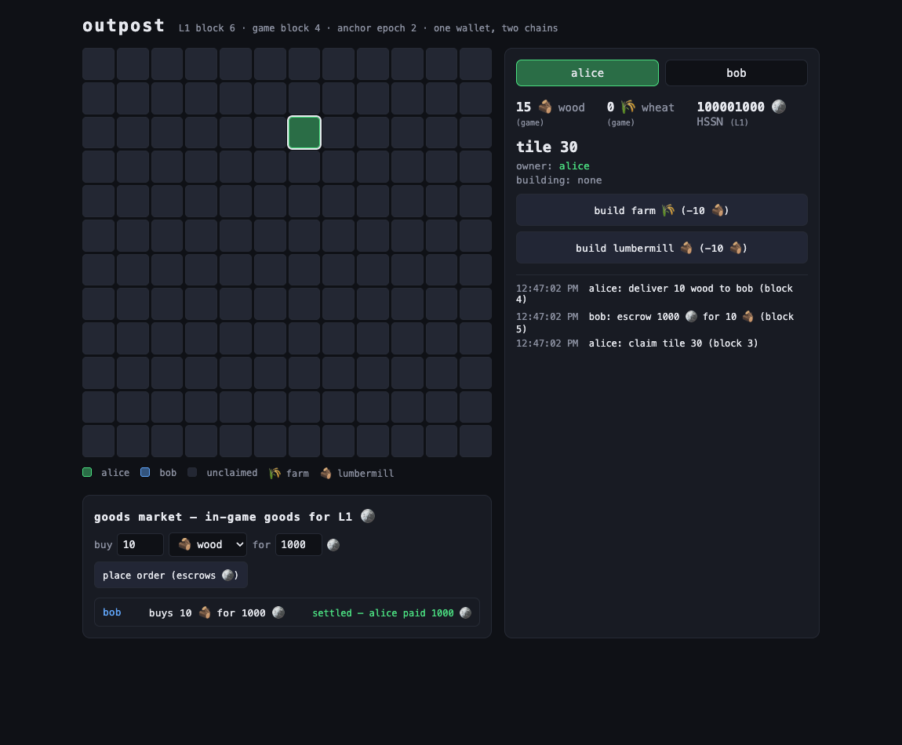
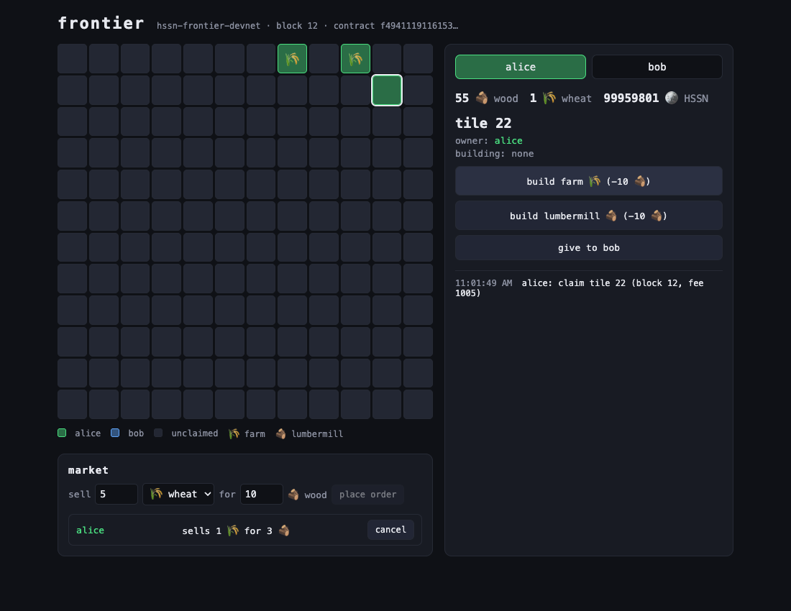

# HSSN — Holepunch Smart Settlement Network

**A decentralized operating system for peer-to-peer software.** Apps get
identity, payments, contracts, and distribution the way they get a
filesystem — by asking the runtime. Holepunch/Pear provides networking,
storage, and app delivery; a small deterministic settlement chain provides
the money; and every app can spin up **its own chain** among its own
players, anchored back to settlement with ~100 bytes.

No hosting. No bridges. No wallet extensions. One Ed25519 identity,
everywhere.

```
who has to agree?          lane            primitive
─────────────────────      ─────────       ─────────────────────────────
nobody (one author)        content         Hypercore feeds
the app's peers            app chain       same chain stack, per-app
everyone (money)           L1              the settlement chain
```

## The demo: an MMORTS across two chains



**Outpost** is a small MMORTS where the game runs on a **player-run app
chain** (claim land, build, harvest — 300ms blocks, ~zero fees) and the
**goods market runs on L1** (real currency, escrowed). One wallet identity
acts on both. The trade in that screenshot:

1. **bob (L1)** escrows 1000 HSSN for 10 wood — a good that _only exists
   inside the game_.
2. **alice (app chain)** delivers the wood in-game, to the same address
   bob uses on L1.
3. The app chain's quorum **anchors** its state root plus one outcome
   call — `settle(order_id, alice)` — and the L1 market releases the
   escrow.

HSSN never left L1. Wood never left the game. The anchor carried
_judgment_, not value — there is no bridge to hack, and a corrupt game
can only ever touch what was voluntarily staked against it. Alice's L1
balance ends at exactly +1000: her only L1 transaction was getting paid.

```sh
pnpm install && pnpm build
pnpm --filter @hssn/example-outpost-web build
node scripts/outpost-demo.mjs        # → http://127.0.0.1:8787
```

## What's groundbreaking here

**⛓️ App chains: consensus as a library.** The node — chain, BFT, VM — is
just packages. An app instantiates a blockchain the way it opens a
database: derive a genesis from the on-chain registry entry, join the
swarm, play. Seasons and matches get their own disposable chains; once
anchored, the block history can evaporate while the outcome lives forever
on L1. (`@hssn/appchain`, [docs](docs/src/architecture/app-chains.md))

**🐍 A Pythonic contract DSL.** Game rules, escrow, markets — written like
Python, compiled to deterministic WASM (`hssnc`: parse → typecheck → Rust
→ wasm32), running identically on L1 and every app chain. The entire L1
side of the outpost economy is this:

```python
contract GoodsMarket:
    config:
        game: address              # appAddress(appId) — no private key exists

    action place_order(good: str, amount: int):
        require(value > 0, "attach the payment as value")   # escrows attached HSSN
        ...

    action settle(order_id: int, seller: address):
        require(sender == config.game, "only the game may settle deliveries")
        o = Order[order_id]
        require(o.phase == 0, "order is not open")
        o.phase = 1
        transfer(seller, o.price)
```

**⚓ Settlement ↔ app-chain communication with no bridge.** The only
cross-chain artifact is the _anchor_: >2/3 of the app's registered
validators sign `(epoch, height, stateRoot, outcome call)`, anyone relays
it in an ordinary transaction, and L1 executes the call with
`sender = appAddress(appId)` — a derived account no private key can
forge. Authorization on the contract side is one line of DSL. No wrapped
tokens, no exit games, no oracle network.

**🌐 The web tier: dapps without extensions.** Browsers can't join the
DHT, so any node operator can run a **gateway** — an untrusted HTTP edge
that relays _signed_ transactions and raw state. The frontier demo is a
full on-chain land game in a browser: keys in the page, Ed25519 via
`@noble/curves` over the same canonical bytes the wallet daemon signs,
65 KB gzipped, zero backend.



**📦 P2P everything else.** Apps ship as signed Hypercore bundles indexed
by the on-chain registry (everyone who installs, seeds — BitTorrent for
software with a chain as the tracker). Game moves, chat, and content ride
feeds; the wallet daemon holds keys behind per-app permission grants; the
chess example plays a wagered match entirely peer-to-peer with only the
escrow touching consensus.

## Install

Node ≥ 20 with corepack (pnpm is pinned via `packageManager`). Rust and
Python are only needed to rebuild WASM artifacts — prebuilt contracts are
committed.

```sh
git clone https://github.com/StuartFarmer/mordecai-2.git && cd mordecai-2
pnpm install
pnpm build      # typecheck + emit all packages
pnpm test       # 194 tests: devnets, BFT, VM, app chains, gateways, e2e
```

## Try everything

| One command                                            | What you get                                                                                                                |
| ------------------------------------------------------ | --------------------------------------------------------------------------------------------------------------------------- |
| `node scripts/outpost-demo.mjs`                        | **The flagship**: MMORTS on an app chain + L1 goods market + anchored settlement, playable at `:8787`                       |
| `node scripts/frontier-demo.mjs`                       | On-chain land game in the browser through the gateway                                                                       |
| `node apps/devnet/devnet.mjs 4`                        | A 4-validator BFT devnet with a funded faucet                                                                               |
| `npx vitest run packages/appchain/test/market.test.ts` | The cross-chain trade proven at the protocol level, adversarial cases included                                              |
| `npx vitest run packages/appchain/test/season.test.ts` | A wagered season: stake on L1, play on an app chain, anchored payout, then _delete the app chain_ — the settlement survives |

## Documentation

The [mdBook](docs/) covers all of it — serve with `mdbook serve docs`:

- [Architecture](docs/src/architecture/overview.md) · [Three (four) kinds of state](docs/src/architecture/state.md) · [App chains](docs/src/architecture/app-chains.md) · [Consensus](docs/src/architecture/consensus.md) · [Threat model](docs/src/architecture/threat-model.md)
- [Building p2p apps](docs/src/apps/what-is-a-p2p-app.md) · [The SDK](docs/src/apps/sdk.md) · [The web gateway](docs/src/apps/gateway.md) · [**How-to: run your app on its own chain**](docs/src/apps/app-chains.md)
- [The DSL](docs/src/contracts/dsl-reference.md) · [Contract tutorial](docs/src/contracts/tutorial.md)
- Examples: [chess](docs/src/examples/chess.md) · [frontier in the browser](docs/src/examples/frontier-web.md) · [**outpost**](docs/src/examples/outpost.md)

Specs: [`SPEC_PT_01–03.md`](SPEC_PT_01.md) (platform) ·
[`SPEC_APPCHAINS.md`](SPEC_APPCHAINS.md) (app chains) ·
[`IMPLEMENTATION_PLAN.md`](IMPLEMENTATION_PLAN.md)

## Status

**v1 core complete (M0–M7) plus the app-chains tier.** The spec §28
vertical slice — registry install, wallet auth, p2p state sync, finalized
payment — passes on a multi-validator devnet, and the app-chains
acceptance (stake → play on a disposable chain → anchored settlement)
passes over a real DHT testnet. Honest limits are catalogued in the
[roadmap](docs/src/roadmap.md): permissioned validator sets, anchors
attest rather than prove (blast radius is per-app by construction), and
the Pear desktop shell itself is still product work.
